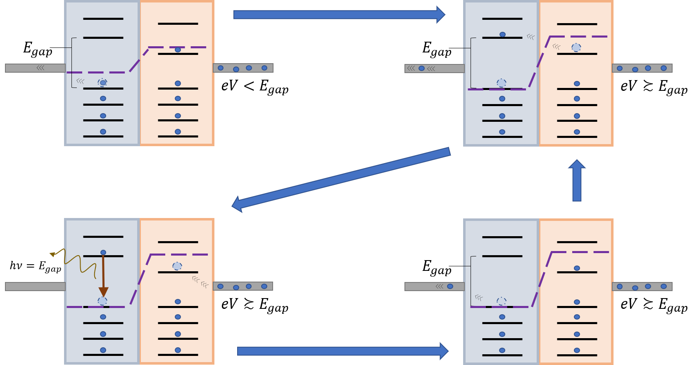

# Planck's Constant From LEDs
:::Materials
 - Battery
 - Red, Green, Blue, Yellow LEDs  @fa-wrench@
 - Potentiometer  @fa-wrench@
 - Breadboard and wires  @fa-wrench@
 - Multimeter

  @fa-wrench@: Included in kit
:::

# Introduction
Planck’s Constant is one of the most important values in physics, establishing the smallest unit of quantization for electromagnetic action. It's most fundamental appearance is in the Planck-Einstein relation:

:::Equation
$$
E = h \nu
$$
:::

which directly relates the frequency of a photon, $\nu$, to its energy, $E$. In this project, we will attempt to measure the value of $h$ using simple electronics components. One of these devices will be the light emitting diode or LED, which directly converts energy carried by electrons into photons in a controlled way. 

The experiment has a fairly simple set up, but many factors involving the components can introduce error into your measurement. This experiment is a creative endeavor where you should push the limits of simple electronics and your knowledge of error analysis to refine results. Your goal in this experiment is simply to obtain **the most precise and accurate measurement of $h$ possible**.

# Basic Theory and Ideas

## Fermilevels and Transitions

:::RFigure fl s

:::
The basic theoretical element at play in this experiment is the concept of Fermilevels. As fermions, electrons are incapable of occupying the same state due to the Pauli Principle. If we have an isolated system with a set of discrete energy levels, as we add electrons, they will tend to fill them up starting with the lowest energy. 

We can image such a system as a reservoir connected to a conducting wire that carries the electrons. When we apply a voltage to the wire, electrons will flow into the system until the energy required to fill the next state is greater than the energy of the electron in the electric potential. We call this limiting value the **chemical potential**, $\mu$.

:::Figure fl m

:::

In general, at zero temperature, the electrons will fill all available energy levels below $\mu$, with the highest energy level occupied called the Fermilevel (or fermisurface in solid-state systems). At finite temperature, the average occupation of a level is given by the Fermi-Dirac distribution:

:::::::::row

::::::col l2
:::Figure fd xs

:::
::::::
::::::col l10
::: Equation 
$$
\langle n_{E}\rangle = \frac{1}{e^{(E -\mu)/k_bT}+1}
$$

:::
::::::

:::::::::

Imagine now that we promote an electron to an energy level higher than the chemical potential.
:::RFigure fl l

::: 
This can be done, for example, by stimulation with a photon. After some amount of time, that electron will *decay* down to a lower energy state by releasing a photon equal to the difference in energy between the starting and final states.

This phenomenon, which is the reverse process of the photoelectric effect, is used in the construction of LEDs. The basic working principle of an LED is to cleverly force an electron into an excited state some energy $E_{gap}$ above the chemical potential, where it will later decay, releasing a photon with a specific frequency of light. In the next sections, we will discuss how LEDs achieve this. 

## LEDs
LEDs (Light Emitting Diodes) are semiconductor devices with specially engineered energy bands that are able to produce a narrow band of photons. Nearly all such devices are constructed from arrangements of doped semiconductor materials. Like the reservoir discussed in the previous section, each semiconductor region has its own energy levels and chemical potentials. By combining two materials with ideally located energy bands, one can force electrons to jump between states and emit photons by applying a voltage across the junction. 

A basic picture of how LEDs work is as follows: 

:::Figure LEDproc

The above image presents a very rough cartoon of how LEDs function. When the voltage is lower than the band gap energy, electrons in the N-type region cannot pass to the higher energy state in the P-type region. Once the voltage across the LED is tuned high enough, the valence electrons can jump to the nearby state in the P-type region. After some time, the electrons naturally decay to combine with one of the holes, since this is more energetically favorable. The difference in energy is emitted in the form of a photon. This process continues as long as the voltage is high enough to allow transport across the junction depletion region. 
:::

# General Experiment

:::LFigure simple l

A simple set up used to test the threshold voltage of four colored LEDs
:::

For this experiment, you should set up a simple circuit that lights up an LED with a tunable voltage. The easiest way to accomplish this is to connect your LED in series with a potentiometer connected back to ground. You should also be sure to place a current-limiting resistor in series with your LED to prevent it from burning out. The value of the current limiting resistor can be calculated using the max voltage that the LED will be exposed to. For a 3.3V power source, I used a $220 \Omega$  resistor with a $10$k$\Omega$ potentiometer. 

A rudimentary first approach to calculating $h$ would be to slowly increase the voltage until the LED begins to turn on. You can then measure the voltage across the LED and record this for your calculation of $h$. A value obtained this way will likely have significant error: your eye's ability to detect photons, the IV characteristics of the LED, the internal resistance of your voltmeter, among other issues. Your project begins here: you should investigate, refine and improve your set up in any way you see fit. You are encouraged to research (and cite) online references, component datasheets, papers, etc in the process of improving your experiment.  

# Useful References

1. [All about Diodes](https://learn.sparkfun.com/tutorials/diodes?_ga=2.235408962.25460028.1613608956-2087921779.1613608956)

2. [All about LEDs and reading their datasheets](https://learn.sparkfun.com/tutorials/light-emitting-diodes-leds?_ga=2.266063436.25460028.1613608956-2087921779.1613608956)

3. [Another resource on LEDs](https://eng.libretexts.org/Bookshelves/Materials_Science/Supplemental_Modules_(Materials_Science)/Semiconductors/Light_Emitting_Diodes)

4. [A simple lab that you can improve on](http://web2.physics.fsu.edu/~2016-YSP/experiments/LEDPlanckExpt.pdf)

5. [Review of PN junctions](https://www.electronics-tutorials.ws/diode/diode_2.html)