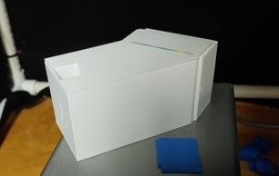
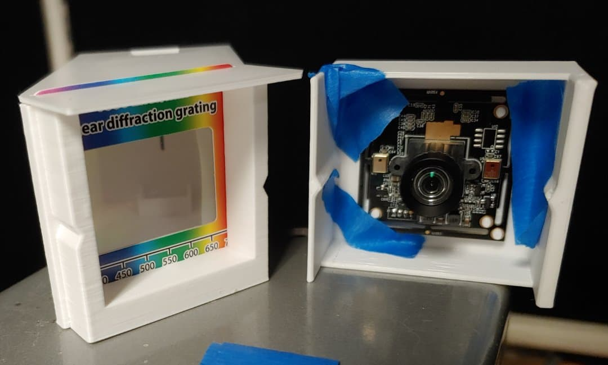
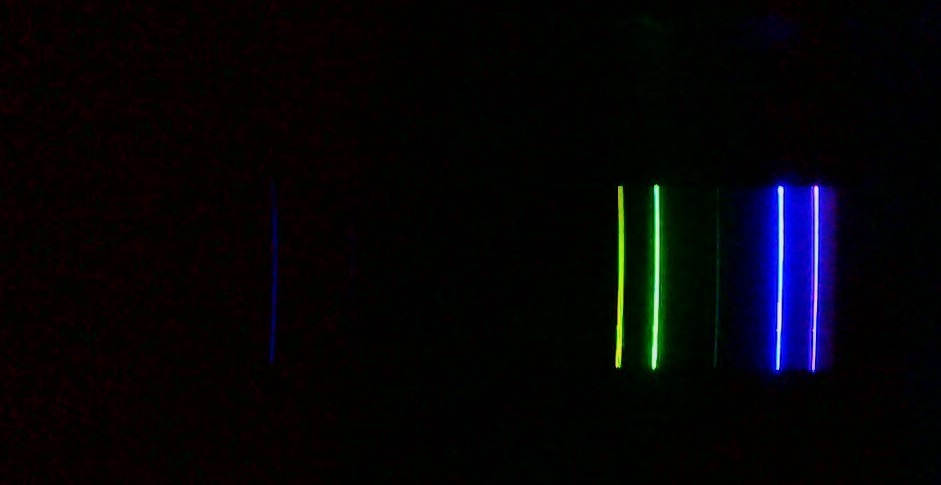
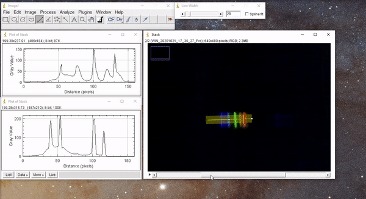

# DIY Spectrometer

:::Materials
 - Diffraction Grating @fa-wrench@
 - Camera @fa-wrench@
 - Something to construct a slit
 - Spectrometer Enclosure @fa-wrench@
 - ImageJ software
 - LEDs @fa-wrench@, fluorescent source, LCD/LED screen to calibrate spectrometer

 @fa-wrench@: Included in kit
:::

# Introduction

Spectroscopy, broadly, is the use of light and its interactions to study matter and phenomena across nearly every physical science discipline. In this project, you will be assembling and using a low-cost spectrometer. Once the spectrometer is functional and calibrated, you will use it to make measurements for your final report. Some ideas for projects are listed in the final section of this manual.

# Spectrometer
In general, a spectrometer should take in a thin slit of light which will pass through a diffraction grating and create an image on a screen. As it passes through a diffraction grating, light is separated by wavelength, similar to a prism. When the diffraction grating is very dense, the light is separated enough to discern contributions from different wavelength either by eye, camera, or (in professional labs) by a photomultiplier tube with an FPGA. A spectrometer allows one to measure a spectrum, or the weighted contribution of bands, which gives the intensity of each component of the incident light

For a transmission grating, where light primarily passes through and a camera is situated behind the grating, the angle that light of a given wavelength  will emerge from the grating is given by the equation

$$
d \sin(\theta) = m \lambda
$$

Here, d is the distance between grating lines,  is the angle of transmission, and  is the order of the maximum (you will want to observe , which is the brightest).

:::Figure
 

 Generic set-up for a simple 4-component spectrometer
:::

## Components
A simple spectrometer has four important components: the enclosure, slit, diffraction grating and a detection screen or camera. Here we will briefly comment on each component and its effect on the spectrum quality.

### Enclosure 
:::RFigure enclosure s

The 3D printed enclosure that will be sent in a package. Built for Rainbow Symphony grating cards and Arducam
:::
The enclosure is the base of your spectrometer. It should do several things:
1. Block external light from entering the spectrometer entirely, to ensure you can obtain clean spectrum with limited background noise.
2. Allow you to attach and manipulate the three other elements easily
3. Should be sturdy enough to keep everything in place and aligned

For this project, we are providing students with 3D printed enclosures for convenience. These enclosures are optimized for [Rainbow Symphony 1000 Line/mm Cards](https://www.amazon.com/Rainbow-Symphony-Diffraction-Grating-Slides/dp/B00K6K3MCW/ref=asc_df_B00K6K3MCW/?tag=hyprod-20&linkCode=df0&hvadid=193126330073&hvpos=&hvnetw=g&hvrand=5113088959113034751&hvpone=&hvptwo=&hvqmt=&hvdev=c&hvdvcmdl=&hvlocint=&hvlocphy=9031643&hvtargid=pla-314886136725&psc=1) which we will also provide. 

Note that the enclosures are made from a gray plastic material that will **not** fully block out light. It is advisable that after tuning your spectrometer, you take the time to cover it with foil or an opaque tape to reduce light seepage. 

### Slit
The slit is exactly what it sounds like: a very thin (~10-200 um) opening that:  
1. Only allows a narrow beam through-- we don’t want a thick beam this will degrade our resolution (overlapping)
2. Blocks light that is not parallel to the normal of the face--  unaligned incident rays will not be diffracted at the same angle from the slit nor from the grating, again, causing overlap and lower resolution.
3. You should be able to adjust easily 
4. Can be secured in place during multiple measurements

The enclosure has a built in slit to ensure that the final beam is aligned to the diffraction grating appropriately. This slit is **not functional** for spectroscopic measurements. You will need to build a narrower slit to attach over it. To build a slit, there are multiple options with advantages and drawbacks. Listed below are some popular choices:

- Simple paper/cardboard/Foil slit: This involves simply taping two pieces of the material to make a small uniform slit between them
    - Pros: 
        - Inexpensive
        - Adjustable
    - Cons: 
        - Poor performance (paper)
        - Somewhat finicky to align by hand
        - Flimsy
- Razors: Sharp razors have very straight edges that are great at “slicing” light, and are routinely used in simple optics setups
    - Pros: 
        - Inexpensive
        - Sturdy and very straight, improving uniformity
        - Metal so they can be attached with magnetics if desired
    - Cons:
        - Dangerous
        - Razors sharpened on both sides can sometimes be a pain to align: if one edge is below the other, you will be allowing angled light to enter.
        - Somewhat finicky to align by hand
- Calipers: Precision measuring tools that usually have a fine adjustment dial
    - Pros:
        - Great control
        - The edges are quite deep, preventing entrance of misaligned rays
    - Cons:
        - Not super cheap (  7 \~  20 Dollars)
        - The edges may not be extremely sharp, leading to blurred spectra
        - Awkward to attach to a set up in a way that prevents light from sneaking in
- Buy a slit: Diaphragms with one or more slits are manufactured by educational and scientific companies
    - Pros:
        - Much better than anything you can actually make yourself
    - Cons:
        - They are fairly expensive ($10-$40) and somewhat rare. You should only buy a slit if you don’t have to spend money on anything else in this project and really want one for personal entertainment
        - If the slit is too small, you won’t get enough light in to see the spectra, and you can’t adjust it.

You are free to experiment with any method you want. In my experience, I prefer using the razor method. In my test build, I attached my razors to the front of my box using a cheap magnet. This allows me to freely adjust the slit until I get a good result, and it is somewhat robust to movement during measurements.

### Diffraction Gratings
This component is essential and has indirect effects on your resolution:
1. Ideally you want more than at least 600 lines/mm to ensure that light is deflected at a large angle, making it easy to resolve nearby wavelengths
2. You will need this grating to be linear so that the light gets spread out horizontally rather than spherically.

For this project, we will be shipping out the aforementioned [Rainbow Symphony 1000 Line/mm Cards](https://www.amazon.com/Rainbow-Symphony-Diffraction-Grating-Slides/dp/B00K6K3MCW/ref=asc_df_B00K6K3MCW/?tag=hyprod-20&linkCode=df0&hvadid=193126330073&hvpos=&hvnetw=g&hvrand=5113088959113034751&hvpone=&hvptwo=&hvqmt=&hvdev=c&hvdvcmdl=&hvlocint=&hvlocphy=9031643&hvtargid=pla-314886136725&psc=1). For students wanting to build their project from scratch, there are fewer options for this component since you cannot really make one yourself:
- You can purchase a set very cheaply. The more lines per mm the better. I bought a set of 10 for $10 through rainbow symphony on amazon 
- You can actually use a CD, DVD, or Blu Ray disc. Each of these options has a different line spacing. If you choose this route, follow a tutorial online on how to prepare it. Note: it may be easier to use these as reflection gratings, so your set up will look a bit different than the one pictured in the introduction, with your camera on the side of the slit instead.

:::Figure align m

The grating and camera fit snuggly into the printed enclosure. I added extra tape to secure the camera on this prototype build.
:::

### Detection Screen (Camera)

Your camera will be your measuring device, ultimately converting the incident photons into digital information. For most setups, after tuning the slit, you may find that your camera will be the limiting factor in your resolution. For this reason, the camera should:
1. Have a decent resolution (at least 1080p)
2. Ideally allow for manual focusing to maximize the sharpness of the spectrum observed

You are free to use any camera you like, but be aware that this component can be a bottleneck for resolution, even if your entire set up is perfectly aligned. Students who can receive a package will get an HD Arducam with manual focusing. For students building their own, some options:
- Most modern cell phone cameras are suitable for this use, especially if they have a macro setting. Please be sure to disable any auto adjustments that may change brightness/contrast, and hence alter your data. In order to control your phone’s camera remotely while it is in your spectrometer, I recommend installing remote control software, such as TeamViewer
- Many webcams will work. If you already own a webcam, try it out. I have tested a few, and I have found that cheap Jelly comb cameras (with a manual focus knob) work fine, as well as many logitechs.
- If you or someone in your household owns a DSLR, this is by far the best choice. Please do not buy a DSLR for this experiment. 

# Getting the Most out of your Build

The resolution of your set up depends crucially on the following factors:
1. Slit width: The wider the beam entering the spectrometer, the less final resolution you can obtain since light of different wavelengths will hit the same section of your lens, making it impossible to differentiate them

2. Alignment of slit and grating: Ideally your slit and grating should be perfectly aligned. If your slit is at an angle to the grating, the resulting beam will have a wider width, incurring the problem above. Additionally, your spectra will be slanted and more difficult to analyze.

3. Camera resolution: At the end of the day, your ability to acquire data from the spectral image is capped by your camera’s resolution and color depth. Like all digital quantities, intensity, coordinate, and RGB values are quantized. In this experiment, you will mostly be limited by coordinate and intensity quantization.

:::Figure

:::

4. Camera Focus: The shipped cameras have lenses to focus incident light onto the CCD screen. You are encouraged to unscrew this lens and inspect how the internal optical components work. When calibrating your device you will need to carefully adjust the camera's focal length to give the sharpest image of the spectral lines possible. For cameras with digital focus, please refer to the documentation for how to adjust it manually.

5. Camera Software: Your camera can only record a finite range of brightness values depending on its bit-depth. 
    - Usually digital cameras will automatically adjust themselves to capture as much detail as possible -- this is the reason that photos sometimes appear “blown out” on sunny days or have trouble capturing details back lit by a bright light. Ideally you will want to use "Manual Mode" on your image-taking software when possible, to control and standardize the post processing of CCD information, using the highest bit-depth allowed. 
    - For cameras that do not offer direct control over post-processing, the best way to battle this is to make sure that *no* stray light enters the chamber, so that brightness and contrast remain constant across all photos.
    - When imaging very bright sources, such as the sun, you will want to make your slit as narrow as possible to prevent your image from being over exposed. For dimmer sources, such as LEDs and flames, you should only open your slit as wide as needed to clearly see a spectrum without risking loss of resolution. 

## More info on Spectrometers

Below are a list of potentially useful resources that dive deeper into the physics of spectrometers
 - [BWTEK Spectrometer Knowledge](https://bwtek.com/spectrometer-part-1-the-slit/)
 - [Public lab Paper Spectrometer](https://publiclab.org/notes/warren/11-30-2017/build-a-papercraft-spectrometer-for-your-phone-version-2-0) (good for a test run before building)

Students with access to lenses and mirrors are encouraged to experiment with them to improve the device resolution.

# Calibration

::: RFigure cal l

Calibration image from a mercury lamp. LCD, LED, or fluorescent lamps work just as well. Be sure to look up the peak locations and widths for which ever calibration source you choose. Note the appearance of second-order maxima on the left side of the image.

:::

Calibration of your spectrometer is a critical step in obtaining meaningful data. The process of calibration allows you to associate positions in your image to wavelengths by observing light samples with **known specra**, essentially constructing a ruler of sorts. Calibration is also where you will demonstrate your knowledge of error analysis to determine the *accuracy* and *precision* of your new device. Whether your spectrometer is able to accurately and precisely measure the peak locations and widths from a set of control sources helps determines the quality and reliability of your final experiment.

Unless your build is extremely sturdy and your camera is fixed, you will need a calibration image for every data run. This means taking photos of the spectrum of a known source (such as LEDs, fluorescent light) either directly before or after imaging the spectrum of your desired source. 

::::::Hider Example Calibration Steps with ImageJ
We suggest using ImageJ to analyze your spectra, but you can use any tool that you are comfortable with. In ImageJ, to convert your image to a spectrum, follow these steps:
1. Select the line tool

 

2. Draw a line perpendicular to your spectral lines (note: try to be as precise as possible!)

 

3. Double click the line tool and increase the width to sample along your line

 

4. Next go to analyze $\rightarrow$ Plot Profile

 

5. You should use the known spectrum to identify the locations of nm marks in pixels, as well as determine your nm/pixel scale.

6. To apply the calibration to your other images, either write down the starting/end points of your line and redraw it, or (much simpler) open all of you photos in ImageJ, choose Image $\rightarrow$ Stacks $\rightarrow$ Images to Stacks. This will combine all of you images into a stacked image so that the profile line is shared between them, as demonstrated in the clip below. You will have to generate a profile plot for each individual image.

:::Figure

 

 Calibration image from a fluorescent lamp using a junk standard definition webcam. I obtained about 2.5 nm/pixel, but with a resolution not quite good enough to resolve the cluster of peaks around the 600nm line, nor the doublet at 550 nm
 

Note my colors don’t line up because I imported images from two different runs. Don’t do this ;) 
:::

7. Once you are happy with your profile, you can export your raw data as a .csv from the “Data>>” menu for further analysis.
::::::

:::Figure result xl

####

Resulting Profile using Image J. Comparison to known Spectra… Not bad!  I have some clear background issues, however. Notice that the left side of my plot seems to be far more illuminated than the right, skewing the peak heights. I would have to peek into my box to figure out what is causing this (likely a reflection! This is why darkness is important!)

:::

# Some Suggested Experiments
- Temperature of the Sun via Black Body Radiation
    - Using your knowledge of black body radiation (Planck’s law, Wien’s displacement law, etc), utilize your spectrometer to measure the temperature of the sun. 
    - You will need to defend your experiment and explicitly deal with sources of error (spectra quality, atmospheric interference with light, elevation, time of data acquisition, CCD response wrt wavelength etc). 
    - Your full spectra should be compared to the accepted, with discrepancies clearly explained in a quantitative or semi-quantitative manner. 
    - A great paper that can be used (and cited) as a guide can be found [here](https://www.physast.uga.edu/~zhaoy/Sun.pdf).
- Sodium Line + Zeeman Splitting
    - When held over a flame, ordinary table salt dissociates into Na+ and Cl- ions. Exposed to such high temperatures, the 3s electrons of the Na+ ions transition to the 3p shell. As they decay back to their original 3s state, they emit a photon in the yellow range of the visible spectrum. The classic experiment is done by holding some table salt over a candle with tweezers or a knife.
    - Using your calibrated spectrometer, you should identify the location of this peak. Note that this peak is actually a doublet due to hyperfine spin-orbit splitting. Clever use of a magnet may allow you to resolve these lines! 
    - You will need to defend your experiment and explicitly deal with sources of error (spectra quality, flame spectra and intensity fluctuations, CCD response wrt wavelength etc). 
    - Your full spectra should be compared to the accepted, with discrepancies clearly explained in a quantitative or semi-quantitative manner. 
- Radius of Earth via Rayleigh Scattering
    - A write up of the problem is provided [here](https://drive.google.com/file/d/1_b2QIZFGB-T2nieoeeruZhsxnNYGo_1_/view?usp=sharing), as well as a visual aid [here](https://drive.google.com/file/d/1Tbu3reRvdLAoLfYFjanmpkiIRcOHxR96/view?usp=sharing)
- Liquid/Gas composition (borrowed from public lab)
    - Detect chlorophyll in olive oil.1 green laser or strong UV light.
    - Shine a laser or a very strong UV light through a sample in a cuvette. Shine the light perpendicular to the direction the spectrometer is pointed, so that you measure only the color emitted by the sample, and not the green laser or UV light itself. If your olive oil has enough chlorophyll (especially greenish, extra-virgin olive oils), you'll be able to see a yellow, orange, or reddish glow. Since the laser (or UV light) is producing no red, orange, or yellow light, that light must have been produced by the "excited" chlorophyll.
     The hardest part of this activity (still not a solved problem!) is getting enough light from the glowing sample to be detected by the camera. Please share your work if you're able to get it to work!
- Measure gases in the atmosphere 
    - Please note: this will only work with a device that can measure near-infrared light
    - This is a simple activity and a good starting place. Simply go outside during the day and point the spectrometer at an evenly illuminated part of the sky -- cloud or blue sky both work.   Even though air is pretty clear, pointing your spectrometer through miles of the atmosphere places many molecules between your spectrometer and your light source (AKA the sun). Because of the sheer amount of molecules, you can see lines where CO2, O2, O3, and water vapor have absorbed part of the spectrum. These are known as the Fraunhofer lines.

