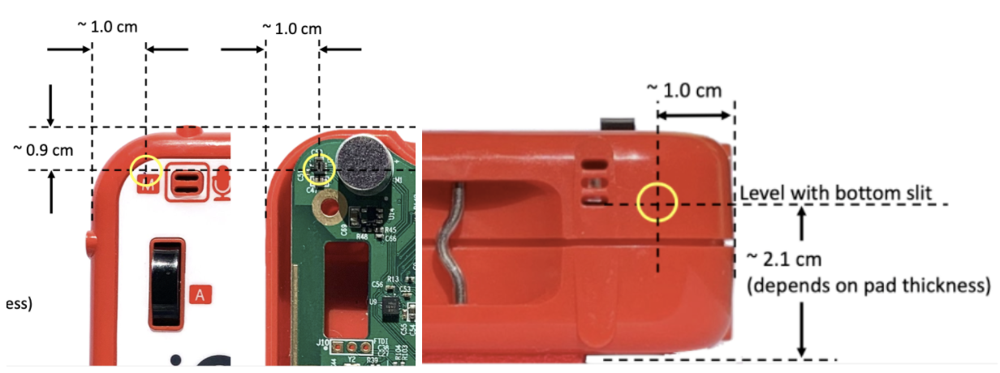
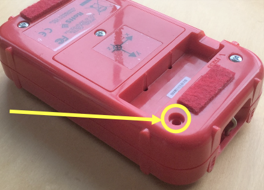
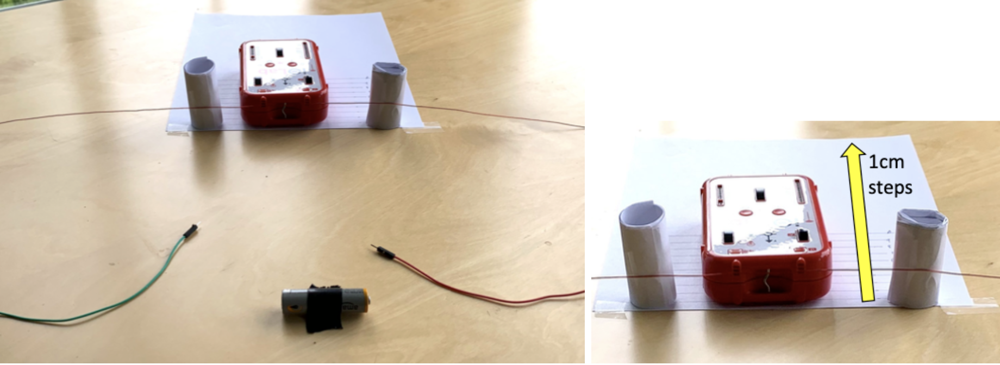
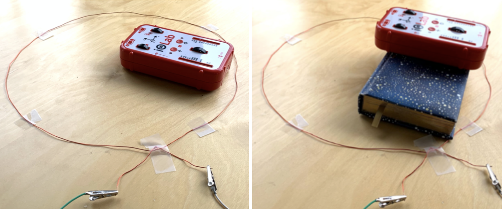

# Lab 2: Magnetic Field
---
### Materials needed for entire lab:
-  iOLab
- A ~1m long wire
- A AAA or AA battery
- Two wires with clips at one end
- Some vertical support (eg, paper, tape, a book…)
- Paper and ruler

---
# Part I: The Biot-Savart Law

In the previous lab, we looked at how moving electric charges feel force in the presence of external electric and magnetic fields. Continuing with the theme of electrodynamics, we will look at the fields and forces caused by moving charges *themselves*.

As you may know, moving charges not only have electric fields, $\vec E$ associated with them, but also produce magnetic fields, $\vec B$ in directions tangent to their velocity. The characterization of such $\vec B$ fields for a single moving charged particle is actually trickier than you would expect --- the motion of the point-like charged particle and constant generation of a magnetic field at every point in time requires relativity to correctly describe --- and will be dealt with in a more advanced course.

It turns out, however, that a *line* of moving charges, such as a current-carrying wire, is much simpler to work with: the resulting magnetic field has a static and well-defined description in terms of the Biot-Savart Law:

$$
\vec B = -\frac{\mu_0 I}{4\pi} \int_C    \frac{\vec r \times d\vec\ell }{|\vec r|^3}
$$

AVOCADO: Simulation showing how integral is done

AVOCADO: Smoother transition into specialized situations below

In this lab, we will explore the Biot-Savart law by indirectly determining *the current* in a wire by *measuring the magnetic field*  it produces. We will focus on two simple set-ups, a long straight wire and a loop of current,  whose integrals result in a simple expression for the magnetic field.

::: Figure:Figure

AVOCADO:replace with gif
:::

For a long straight wire, the magnetic field around is given by

::: Figure:Equation
$$
B = \frac{\mu_0 I}{2 \pi R} 
$$
:::
where the magnetic permmitivity of free space is $\mu_0 = 4\pi\times 10^{-7}$ T kg/A

::: Figure:Figure

AVOCADO:replace with gif
:::

For a loop of wire, the relation between the current and the magnetic field is

::: Figure:Equation
$$
B = \frac{\mu_0 I}{2} \frac{R^2}{(R^2+z^2)^{3/2}}
$$
:::

AVOCADO: Should I show how to calculate these explicitly? Maybe in an appendix?
# Part II: Experiment

## 1. Prelab setup

Since we are making direct and quantitative measurements of a magnetic field in this lab, it is critical to know the exact location of the magnetometer on iOLab. We know from the previous lab that the magnetometer is more or less under the “M” label printed on the top left corner. Figure 3 shows an image of the iOLab without the top cover.

::: Figure:Figure

:::

These diagrams  demonstrate the exact location of the magnetometer. As you conduct the experiment, you will need to use the coordinates ($x, y, z$) of its position. Keep these measurements in mind while performing the experiment and doing the calculation. 
######
Similar to the previous lab, we must calibrate the magnetometer to verify the accuracy of the measurements. As emphasized in the previous lab, be sure to do the calibration away from steel objects (eg, the frame under many desks) since these will distort the Earth’s magnetic field, whose vertical component is used in the calibration process.
(AVOCADO: do we need to mention this?) Some of the original devices were assembled with steel screws that can slightly distort external magnetic fields. You can test it by using a magnet: If a magnet is attracted to the assembly screw closest to the magnetometer of your device, just remove that screw for these experiments to eliminate this issue. 

::: Figure:Figure

:::

## 2. Long straight wire

### Materials needed:
- iOLab
- A ~1m long wire
- A AAA or AA battery
- Two wires with clips at one end
- Some vertical support (eg, paper, tape)

::: Exercise
In this geometry, the wire is sitting flat on the desk, parallel to the iOLab x-axis. It is displaced from the magnetometer in both the y and the z direction. This means that the magnetic field at the magnetometer will have both y and z components. Therefore, you will need to turn on both Bz and By on the plot.

::: Figure:Figure

:::
On a piece of paper, draw 10 iOLab locations spaced 1cm apart in the y direction. You will then measure the B field strength at 10 different y locations. It would be easier to align the iOLab and take the magnetometer offset from wire later in your calculation. 
######
Once everything is set up correctly as shown above, you are ready to take data. To avoid heating and battery drain, we want to touch the wires to the battery terminals for under a second each time. For each measurement, you should see a narrow dip on both of the components.
######
Notice that if you are doing the experiment on a desk with a steel frame, the baseline B field will shift since the iOLab is moved over different regions of the desk. This is corrected for by measuring the B field components both before and during each current pulse, and then finding the difference. This difference will be the field due to just the current. 

::: Question
Make a table with (1) horizontal offset y in cm, (2) distance between the wire and the magnetometer R in m (be sure to take the magnetometer offset from wire into account), (3) 1/R, (4) By signal in uT, (5) By baseline in uT, (6) net By in uT, (7) Bz signal in uT, (8) Bz baseline in uT, (9) net Bz in uT, and (10) magnetic field strength B in T.
:::

::: Question
Plot B vs 1/R. Determine the current I from the slope.
:::

::: Question
Assuming that you performed the experiment correctly, name one biggest uncertainty.
:::
:::

::: Exercise
Now we will repeat the procedure for a similar setup. In this geometry, the wire is parallel to the iOLab x-axis, but it is raised in the z-direction so that it is at the same height as the magnetometer. In this case, the magnetic field will only have the z component. 

::: Figure:Figure

:::

Repeat the experiment, and you will have a second measurement for the current.
::: Question
Make a table with (1) horizontal offset y in cm, (2) distance between the wire and the magnetometer R in m (be sure to take the magnetometer offset from wire into account), (3) 1/R, (4) Bz signal in uT, (5) Bz baseline in uT, (6) net Bz in uT, and (7) magnetic field strength B in T.
:::

::: Question
Plot B vs 1/R. Determine the current I from the slope.
:::

:::

## 3. Loop of wire

### Materials needed:
- iOLab
- A ~1m long wire
- A AAA or AA battery
- Two wires with clips at one end
- Some vertical support (eg, a book)

::: Exercise
Now we will place the wire in a loop of radius R in the x-y plane. Put the magnetometer at the center of the loop (x = y = 0) so that the magnetic field is parallel to the z-axis. We will make measurements for two different z values while keeping R constant. Add something under the iOLab to get a larger z for the second measurement. 
::: Figure:Figure

:::
Similarly, the wires are touched to the battery terminals for under a second each time to avoid heating and battery drain. You can make two measurements at the same time. You should see two step pulses with different magnitudes. Then use equation 2 to calculate the current from the measured B field.

::: Question
Make a table with (1) loop radius R in m, (2) magnetometer height z in m, (3) $\frac{R^2}{(R^2+z^2)^{3/2}}$  , and (4) current I in A.
:::

We measured the magnetic field in two basic geometries: a long straight wire and a planar loop. Now you have 4 current measurements. Check if they are consistent.

::: Question
Calculate the variance. Comment on source of errors.
:::
:::