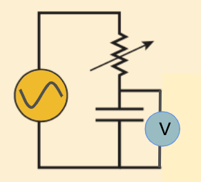
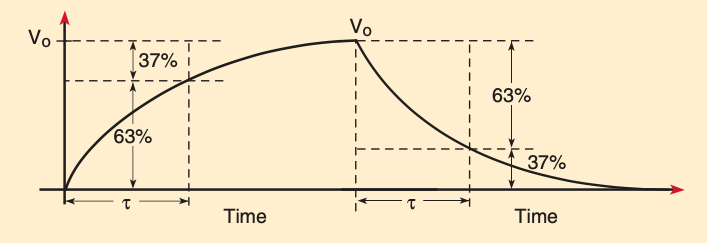

# Lab 4: RC Circuit
---
### Materials needed:
- iOLab
- Wire Leads
- One 10kΩ resistor
- One 2kΩ resistor
- One 100μF capacitor
- One 56μF capacitor
---
## 1. Resistors and Ohm’s Law
If there is a potential difference, eletrons (negatively charged) will move from low potential to high potential. The movement of electrons forms current. Current is defined as the rate at which changes move:

::: Figure:Equation
$$
I =  \frac{dQ}{dt}
$$
:::
Resistors will slow the rate at which charge flows. Current, resistance, and potential difference are related by Ohm’s Law:

::: Figure:Equation
$$
I =  \frac{\Delta V}{R}
$$
:::

where ΔV is the voltage across the resistor in Volts (V), R is the resistance of the resistor in Ohms (Ω), and I is the current in the resistor in Amperes (A).
######
Recall that for resistors in series, the equivalent resistance is given by

::: Figure:Equation
$$
R_{eq} =  R_{1}+R_{2}+R_{3}
$$
:::
And for resistors in parallel, the equivalent resistance is given by

::: Figure:Equation
$$
\frac{1}{R_{eq}} =  \frac{1}{R_{1}}+ \frac{1}{R_{2}}+ \frac{1}{R_{3}}
$$
:::

::: Question
A 5kΩ resistor is placed in series with two 10kΩ resistors in parallel. The entire circuit is connected to a power supply of 20V. What is the voltage across each element?
:::

## 2. Capacitors

A capacitor is a device which stores energy using two closely spaced plates separated by an insulating material. By connecting a capacitor to a battery source, we will be able to collect charge on the capacitor. The energy is stored as an electrostatic field.

::: Figure:Figure

:::

The voltage across a capacitor is directly related to the amount of charge on the plates. A larger amount of charge results in a larger potential difference across the capacitor. The relation between the voltage across and the amount of charges on the capacitor is given by

::: Figure:Equation
$$
V =  \frac{Q}{C}
$$
:::

where Q is the charge in Coulombs (C), C is the capacitance in Farads (F), and V is the voltage in Volts (V).
######
Using the definition of current (Equation 1), we have

::: Figure:Equation
$$
I =  \frac{d(CV)}{dt} = C \frac{dV}{dt}
$$
:::

which relates the current into a capacitor to the rate of change of the voltage. Note that it takes some time to build up charges. So the voltage across a capacitor cannot instantaneously increase.

::: Question
A 0.1μF capacitor has 16V across its terminals. How much change does it hold?
:::

::: Question
What is the current flowing into a 0.01μF capacitor if the voltage across its terminals changes at a constant rate of 2mV per second?
:::

::: Figure:Figure

:::
Before the switch is closed, the capacitor initially begins without charge and thus carries 0 voltage. At the instant the switch is closed, the charging process begins, and charges start to build up on the plates. However, voltage cannot change instantaneously. At this moment, because there is no charge on the plates, it is easy for charges to pass through. Therefore, the greatest amount of current flows at this first instant.
######
As the current flows, the capacitor becomes charged, and its voltage builds up gradually. As the capacitor’s voltage increases, the voltage on the resistor decreases. Recall that the same current goes through all elements in series. Due to Ohm’s Law, less current results in more slowly charging of the capacitor.
######
The charging process continues as the voltage on the capacitor asymptotically approaches that of the power source. At this point, the current decreases to 0, and voltage on the resistor goes to 0 as shown on the figure above.

::: Question
Why does the greatest amount of current flow initially? Why does it decrease as time passes?
:::

::: Question
Why does the voltage across the resistor decrease to 0V later in time?
:::

Discharging a capacitor reverses the process. Say the fully charged capacitor has voltage $V_0$. When the circuit is closed, the voltage on the capacitor will be dropped across the resistor, causing a current to flow. As the charges leave the capacitor, the voltage on the capacitor asymptotically falls to zero.

::: Question
Comment on how voltage changes across capacitor and resistor separately during the discharging process. You may use words or plots or both.
:::

Combining equations (2) and (6) and rearrange, we will get 

::: Figure:Equation
$$
\int_{V_0}^{V} \frac{dV}{V}=  - \frac{1}{RC}\int_{0}^{t} dt
$$
:::

Solving this integral, we will find out that the equation for the capacitor discharging is described by

::: Figure:Equation
$$
V=  V_0 e^{- \frac{t}{RC}}
$$
:::
This indicates that the voltage across the capacitor decreases exponentially as current passes through. The value RC is defined as the time constant 𝛕. Therefore, the quantity RC have units of time, and the equation becomes

::: Figure:Equation
$$
V(t)=  V_0 e^{- \frac{t}{\tau}}
$$
:::
It is important to note that for one circuit, 𝛕 is constant.

::: Question
Write down the equation for a charging capacitor. You can assume that the fully charged capacitor has voltage $V_0$.
:::

In this lab, we will build the described RC circuit with a switchable battery source (iOLab device). When the battery source is turned on, the capacitor will charge up according to the equation above. When the battery is turned off, the capacitor will discharge instead.
######
In addition to calculating the time constant for different circuits, we will be wiring the capacitors in both series and parallel configurations. The equation for the equivalent capacitance in series is

::: Figure:Equation
$$
\frac{1}{C_{eq}} =  \frac{1}{C_1}+ \frac{1}{C_2}
$$
:::

The equation for the equivalent capacitance in parallel is

::: Figure:Equation
$$
C_{eq} =  C_1+C_2
$$
:::
## 3. RC circuits
---
Materials needed:
- iOLab
- Wire Leads
- One 10kΩ resistor
- One 2kΩ resistor
- One 100μF capacitor
- One 56μF capacitor
---
Now let’s set up 4 RC circuits. For each setup, you will measure the time constant and compare it to the theoretical value.
### 3.1 A 100μF capacitor and a 10kΩ resistor in series
::: Exercise
For the first measurement, we are going to place a 100μF capacitor in series with a 10kΩ resistor. In addition, a voltmeter needs to be placed across the capacitor in order to visualize both charge up and discharge situations.

::: Question
Calculate the theoretical value of the time constant for this RC circuit. 
:::

To enable turning on and off the power supply, we will use the D6 digital output pin from the lower right corner of the iOLab. To get to this functionality, go to “settings” on the top toolbar and select “expert mode” then “output configurations”. On the left side of the software, below all the sensors, will be a new heading “Output” and you will find the D6 output underneath that with an “on/off” button. The voltmeter will be achieved by the analog input pin A7 and using the Analog 7 Sensor. 

::: Figure:Figure

:::
The D6 output and the Ground on the iOLad will be the positive and negative leads of this circuit respectively. Wire the 10kΩ resistor and the 100μF capacitor in series. Then take a longer wire to connect the A7 pin on the iOLad to a point between the resistor and the capacitor.
######
Once you have wired the circuit, you are ready to open the software and collect data. On the Analog 7 plot, go to “settings” on the top panel then “output config” and click “Remote 1”. If you select the “on” button for D6 output, you will see a “0 V/3.3 V” button next to it. Keep it at 0V when we first start recording and then switch it to 3.3V. Start recording, and if nothing shows up on the plot, switch on and off the buttons for a few more times.
######
Eventually, when you turn the voltage on, you will see a charge curve; and when it’s turned off, you will see the discharge curve. Stop recording. You should get a similar plot to the one below, except that your plot will have a horizontal line between the two phases, corresponding to the time lapse before you switch to discharge mode. You may notice that the provided voltage is 3.3V, however, it only reaches to 3V on the plot . Don't worry about this. This is due to a property of the software itself.

::: Figure:Figure

:::
Now use “zoom mode” to zoom in horizontally on the discharge curve, and then change back to “analysis mode” and pick two points on the curve. Note that we want to avoid picking up points very close to the two ends, which may not be as accurate as the data in the middle region.
######
Once you have chosen your two points, plug them into equation (9) and solve for 𝛕. Repeat the procedure for the charge curve. Note that you will use your answer for Q7 for the charging process.
::: Question
What are the values calculated from charge and discharge curves? Are they close? Is it sufficient to measure 𝛕 from only one of the curves? Explain your reasoning.
:::
::: Question
What is the experimental value of 𝛕? Compare it to the theoretical value by calculating percent error.
:::
:::

### 3.2 A 100μF capacitor and a 2kΩ resistor in series
::: Exercise
Repeat the procedure described in 3.1 with a 2kΩ resistor instead. This is now a new circuit with a new time constant.

::: Question
Calculate the theoretical value of the time constant for this RC circuit.
:::

::: Question
Compare the experimental value of 𝛕 to the theoretical value.
:::

::: Question
How is the discharge process different compared to the set up in 3.1?
:::
:::

### 3.3 A 56μF capacitor, a 100μF capacitor, and a 10kΩ resistor in series
::: Exercise
Repeat the procedure in 3.1 by adding a 56μF capacitor in series in the circuit. You need to make sure that the voltmeter will be measuring the voltage across both capacitors.

::: Question
Calculate equivalent capacitance and the theoretical value of the time constant.
:::

::: Question
Compare the experimental value of 𝛕 to the theoretical value.
:::

::: Question
How is the discharge process different compared to the set up in 3.1?
:::
:::

### 3.4 A 56μF capacitor and a 100μF capacitor in parallel, and a 10kΩ resistor in series
::: Exercise
Repeat the procedure in 3.1 by adding a 56μF capacitor in parallel in the circuit. Again, the voltmeter should be measuring the voltage across both capacitors.

::: Question
Calculate equivalent capacitance and the theoretical value of the time constant.
:::

::: Question
Compare the experimental value of 𝛕 to the theoretical value.
:::

::: Question
How is the discharge process different compared to the set up in 3.3? What can you infer about the equivalent capacitance in both circuits?
:::
:::

