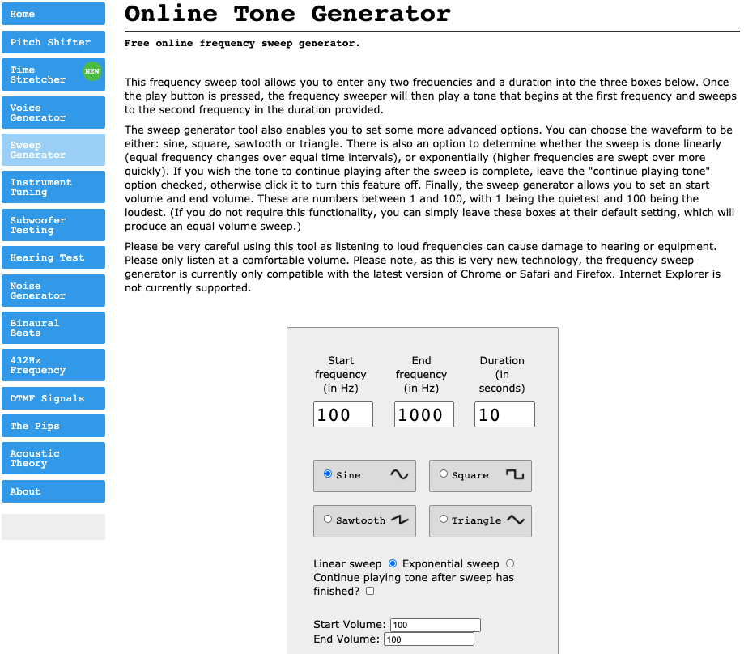

# Lab 5: RLC Circuit
---
### Materials needed:
-  iOLab
- 3.5 mm audio extension cable
- Two 3.5 mm audio jack adapters
- Hook up wire(s)
- One 100 mH inductor
- Two 0.47 μF capacitors
- One 0.22 μF capacitor
- Earbuds, headphones, or other audio listening device (not provided in the knit)
---
## 1. Overview
The RLC circuit plays an important role in nearly all wireless communications applications. In this lab, we will intercept the signal from the audio jack of your personal computer or cell phone, and use it as a source of a variable frequency to drive headphones. We will insert an inductor and capacitor in series with the headphones, which play the role of a resistor. The iOLab will pick up the output of the headphones using the Microphone probe. By filtering the signal with an inductor and capacitor, we’ll be able to show the effect of a resonant circuit and check that the frequency of the resonance changes in the expected manner when varying the values of L or C.

## 2. Reactive elements in AC circuits
This lab will involve the study of AC circuit theory. Both AC and DC circuits deal with relationships between voltages and currents. Both have laws for which voltage is proportional to current. For DC circuits containing resistors,

::: Figure:Equation
$$
V = I R 
$$
:::

and for AC circuits:

::: Figure:Equation
$$
V = I Z
$$
:::
where Z is the impedance of the circuit element.

The following table summarizes the reactance for each of the elements:

::: Figure:Table
| Device| Reactance |
| -------- | -------- |
| R     | R     |
| L     | $\omega$L  |
| C     | $\frac{1}{\omega C}$    |
:::

Note the impedance of the inductor and capacitor depend upon ω, so the amount of current through the circuit varies with frequency. The RLC circuit exhibits a resonance condition when the impedance of the inductor matches that of the capacitor:

::: Figure:Equation
$$
\omega L = \frac{1}{\omega C}
$$
:::

Then we have the expression for frequency at largest current:

::: Figure:Equation
$$
\omega  = \frac{1}{\sqrt{L C}}
$$
:::

where ω is the frequency in per seconds (s-1), L is the inductance in Henries (H), and C is the capacitance in Farads (F). Or equivalently,

::: Figure:Equation
$$
f  = \frac{1}{2 \pi \sqrt{L C}}
$$
:::

## 3. Audio setup

We will use the audio output of your PC, cell phone, or other device as a means of generating a variable frequency AC source. To do this without damaging your ear buds or other audio equipment, we need a pair of audio jacks in the circuit.

:::Exercise
Use a wire to connect each pin on one audio jack to the corresponding pin on the other (might need more instructions here). Use the cable to connect one of the audio jacks with your audio device. Plug the headphone into the other audio jack.
######
To check whether the connections are as desired, you will be able to hear through the ear buds. First, start playing something, and listen to verify that it plays through both channels. Then check for all three wires connecting the jacks: Take out one end of the wires from one pin, and hear if (1) right, (2) left or (3) both earbud(s) is/are silent. 

::: Question
Record the wiring pattern of the audio jacks. 
:::

You can disable one channel by removing the corresponding wire so that the other channel is the only source of sound for the next part of the lab.
:::

## 4. AC circuit setup

We will use the audio output of your PC as the AC source and the headphones as the resistor. Together this makes up a standard AC resonant circuit, so we expect the resonant frequency is given by equation (3).
######
At resonance, the impedance of the circuit is minimum and the current through the circuit is maximum. As a result, we will hear the “loudest” response when the frequency of the AC source hits the resonant value. To accomplish this trick, we will use a website (http://onlinetonegenerator.com/frequency-sweep-generator.html) to make a programmable frequency that will sweep from below resonance to above resonance. The Microphone probe and sensor will allow us to spot the moment when the circuit is at resonance. Using the FFT (Fast Fourier Transform) function in the iOLab software, we will measure the resonant frequency.
######
To use the FFT function, first select “microphone” on the sensor list. You will see the FFT function is on the pull down menu below the plot. The number means how many digitizations are used to produce the FFT. The more time bins we use, the lower the frequency FFT is able to see. If you don’t see a signal on the lower panel, just drag the x axis to a higher frequency range.

:::Exercise
To set up the AC circuit, first make sure that only one earbud is making sound. Then connect the 100mH inductor and a capacitor in series. Then go to the tone generator website, make sure your setting is on “Sweep Generator” on the left. Set the frequency to 100-1000 Hz and let it run for 10 seconds. Choose “Linear sweep” and uncheck the “continue playing” box. Change the volume to 100. Also turn the volume up to maximum on your PC.

::: Figure:Figure

:::
:::

## 5. Take measurement

::: Exercise

When taking data, follow these steps:
- Be quiet, since other voices will interfere
- Hold the active earbud to the iOLab microphone input
- Press record on the software
- Press play on the tone generator
- Wait for 10 seconds for the tone to run the full range of frequencies
- Stop recording
- Analyse the data to find the resonant frequency
######
Set up the circuit with different capacitor configurations and repeat the procedure. For each setup, you will use the same 100mH inductor and the following capacitor(s):
- A 0.47μF capacitor
- A 0.22μF capacitor
- Two 0.47μF capacitors in parallel
- A 0.47μF capacitor and a 0.22μF capacitor in parallel

Complete a measurement of the resonant frequency by using the Microphone sensor and the FFT function. You should see a smooth resonant peak on the top plot. When you find the exact peak position, move the cursor to the bottom plot and identify the corresponding frequency. Note that for the parallel configurations, you will have to calculate the equivalent capacitance before calculating the resonant frequency.

::: Question
Make a table of (1) capacitor configurations, (2) calculated frequency, and (3) measured frequency.
:::

::: Question
Plot the expected frequency vs. the measured frequency. Fit the data with a linear trend line that requires the intercept be at y=0. Based upon the plot and the slope parameter, draw a conclusion about whether your data supports the theory of AC resonant circuits.
:::

:::