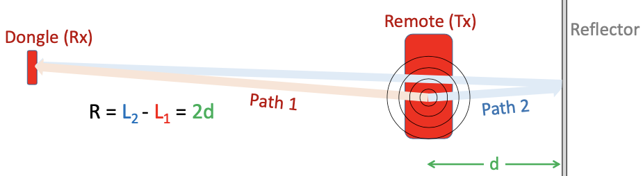
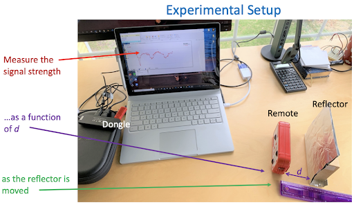
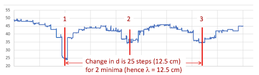

# Lab 6: Speed of light
---
### Materials needed:
-  iOLab
- aluminum foil (about one square foot) 
- something to support the aluminum foil vertically
---
## 1. Overview
In this lab, we will use interference of light to measure the speed of light indirectly. When the iOLab device transfers data to the iOLab dongle, we can measure the wavelength of the transmitted radio frequency electromagnetic waves. Since we know the frequency, we can find the speed of light by

::: Figure:Equation
$$
c =  \nu \lambda 
$$
:::

The iOLab remote device transmits coherent waves in all directions. The dongle then detects the superposition of all direct and reflected waves at its location. If we set up the aluminum foil as a reflector, the direct (Path 1) and reflected (Path 2) waves will interfere either constructively or destructively at the dongle, depending on the relative path difference R. 

::: Figure:Figure

:::
::: Question
What are the requirements of the setup in order to see interference patterns? If you cut two holes in a piece of paper and shine a light through it, will you see it?
:::

::: Question
Can we use a piece of wood as the reflector? Explain.
:::

::: Question
If the surface of the aluminum foil is very uneven (i.e., waves will reflect in random directions), will this affect the experiment? Why or why not?
:::

By moving only the reflector to change distance d, we can measure the strength of the signal received by the dongle as a function of d. Recall that constructive interference happens when the path difference is an integer multiple of the wavelength. This implies that we should see adjacent minima when R changes by one wavelength (λ), corresponding to d changing by λ/2.

::: Figure:Figure

:::

::: Question
Examine the setup closely. You will find that the path difference is not exactly 2d. Explain why we can make this approximation in the calculation.
:::
## 2. Experimental setup

Note that we need version 1.77.1579 (or later) of the iOLab application in order to plot the signal strength (called RSSI in sensor list). Make sure you get the version with RSSI.

::: Exercise
As shown in the figure below, the antenna icon on the iOLab device indicates the general location of the antenna on the internal circuit board. The actual location is a bit further forward. Try to put the antenna at the same level as the dongle.

::: Figure:Figure

:::
Begin with d = 5 cm. Move the reflector back by 5 mm at a time, let it record data for about a second, and repeat this about 30 times.

::: Figure:Figure

:::
:::
## 3. Analysis
::: Exercise
You should see a periodic pattern on the plot. Recall that the distance between two adjacent minima corresponds to λ/2. So you can infer information about the wavelength from the number of steps and locations of minima.

::: Figure:Figure

:::

Given that the iOLab radio operates at 2.4GHz, calculate the speed of light.
::: Question
What’s the measured wavelength and c? Calculate percent error.
:::
::: Question
If you want to improve the accuracy, what changes can you make in the procedure?
:::
::: Question
What is a potential source of error, given that you perform the experiment correctly?
:::
:::