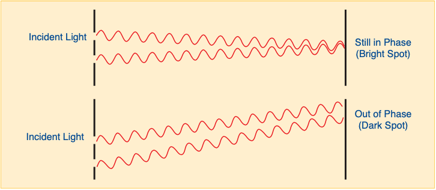
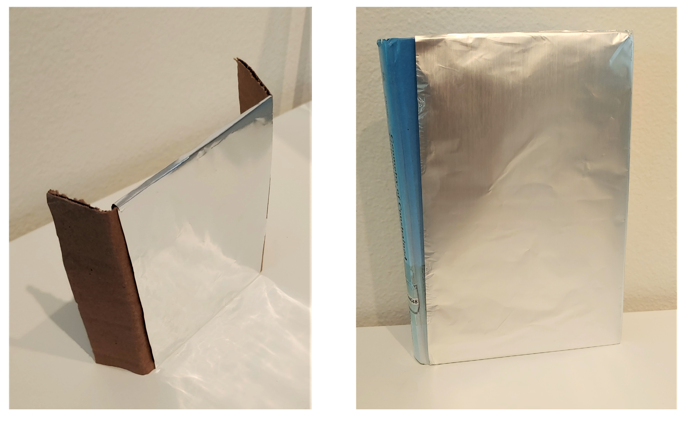
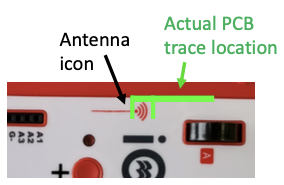
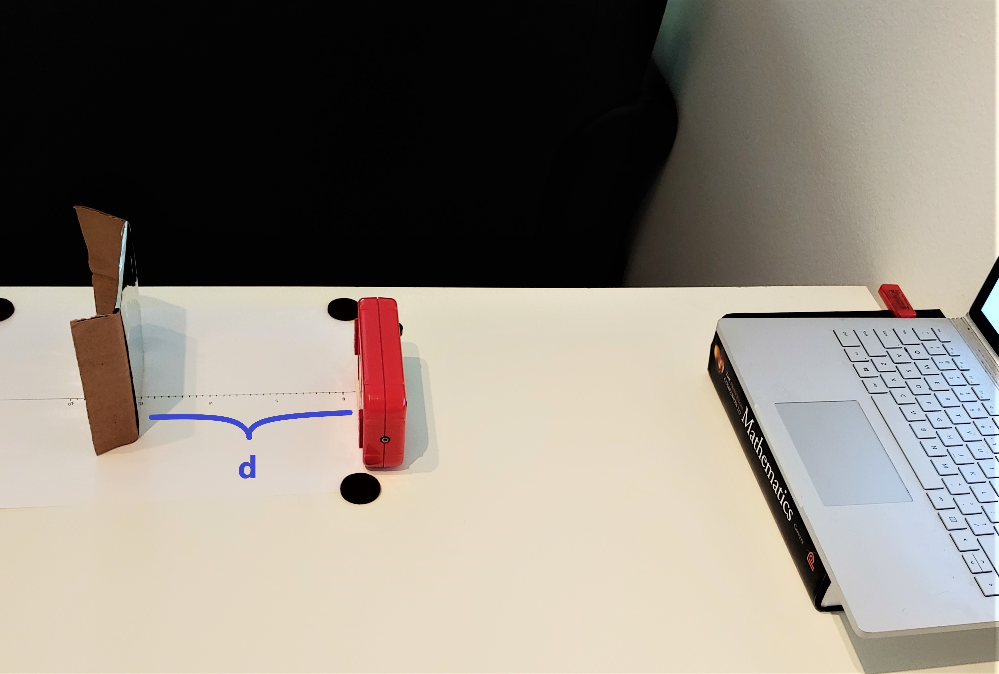
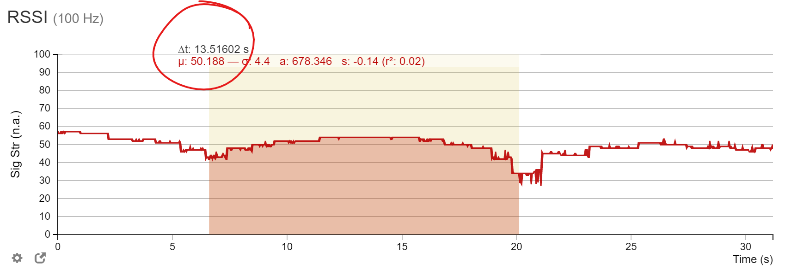

# Lab 5: Speed of light
---
### Materials needed:
-  iOLab
- aluminum foil (about one square foot) 
- something to support the aluminum foil vertically
- ruler
- paper
---

# Part I: Light 
In this lab, we will use interference of light to measure the speed of light indirectly. The iOLab device comminicates with the USB dongle using * wifi*, which --- you guessed it --- is simply ordinary light with a relatively large wavelength (compared to "visible" light, that is). Like many wifi devices and routers, the iOLab operates in the 2.4 GHz frequency band.

Since we know the frequency, $\nu = 2.4 GHz$, if we are able to determine the *wavelength*, $\lambda$, of the signal, we can find the speed of light by using the fundamental relationship:

::: Figure:Equation
$$
c =  \nu \lambda 
$$
:::

When the iOLab device transfers data to the dongle, it transmits coherent waves in all directions. These waves superimpose on one another, experiencing constructive and destructive interference throughout space. The dongle detects the resulting signal at its location. We can use this to measure the wavelength of the light, since a cleverly placed reflector can maximize or minimize the signal strength at the dongle!

####

In this lab, we will use ordinary aluminum foil as a reflector. When light hits a reflector, it reverses direction while maintaining its phase. By positioning the reflector at various distances behind the iOLab antenna, we can force the signal to interfere with itself --- in simpler terms, the reflected signal will be $\pi$ out of phase in a given location and cancel out the non-reflected signal . The basic idea is captured in Figure 1: the direct (Path 1) and reflected (Path 2) waves will interfere either constructively or destructively at the dongle, depending on the relative path difference R. 

::: Figure:Figure

:::
::: Question
What are the requirements of the setup in order to see interference patterns? If you cut two holes in a piece of paper and shine a light through it, will you see it?
:::

::: Question
a) Why is the difference in path length $2d$ and not just $d$?

b) Examine the set up closely. You will find that the path difference is not exactly 2d. Explain why we can make this approximation in the calculation.
:::

::: Question
If the surface of the aluminum foil is very uneven (i.e., waves will reflect in random directions), will this affect the experiment? Why or why not?
:::

By moving only the reflector to change distance d, we can measure the strength of the signal received by the dongle as a function of d. Recall that constructive interference happens when the path difference is an integer multiple of the wavelength. This implies that we should see adjacent minima when R changes by one wavelength (λ), corresponding to d changing by λ/2.

By moving the reflector to change the distance $d$, we can find the locations that result in a minimum in the wifi signal strength, and hence destructive interference. Recall that constructive interference happens when path difference is an integer multiple of the wavelength. This implies that we should see adjacent minima when R changes by one wavelength (λ), corresponding to $d$ changing by λ/2.

# Part II: Measuring the speed of light via wifi signal strength

## 0. Pre-lab setup
---
### Materials needed:
- aluminum foil (about one square foot) 
- something to support the aluminum foil vertically
- ruler
- paper
---

The setup for this lab is extremely easy: we need to construct a vertical reflector from aluminum foil, and a horizontal track to move it along which lines up with the iOLab dongle.

:::Exercise
1. Using aluminum foil and your support, fashion a reflective surface. Try to avoid "wrinkling" the foil as much as possible. A few examples of possible setups are shown below.
::: Figure:Figure

:::
2. Draw a line down the center of your paper using ruler, and mark out 0.5 cm steps. You want about 20 cm of markings on your paper
3. Rotate the paper so that the line points directly toward the dongle in your computer or laptop.
4. Once the paper is lined up, tape it down to the table you are working on so it doesn't move. 
5. Your final setup should look something like the image below (I ran out of tape so I used stickers). 

::: Question
Examine the setup closely. You will find that the path difference is not exactly 2d. Explain why we can make this approximation in the calculation.
:::

Note that we need version 1.77.1579 (or later) of the iOLab application in order to plot the signal strength (called RSSI in sensor list). Make sure you get the version with RSSI.

::: Exercise
As shown in the figure below, the antenna icon on the iOLab device indicates the general location of the antenna on the internal circuit board. The actual location is a bit further forward. Try to put the antenna at the same level as the dongle.

::: Figure:Figure

:::
Begin with d = 5 cm. Move the reflector back by 5 mm at a time, let it record data for about a second, and repeat this about 30 times.

Also you should try to keep the antenna and dongle at the same height. Notice that I raised the laptop on a book in later images to make sure that the dongle was coplanar with the position of the iOLab antenna

:::

:::Question
Why might "wrinkles" interfere with the experiment? Include a ray diagram to support your answer.
:::

## 1. Measuring the speed of light 
---
### Materials needed:
- setup from part 0
- iOLab and dongle
---

In this exercise, we are going to use the Received Signal Strength Indicator (RSSI) on the iOLab dongle to measure the speed of light. The RSSI is a run-of-the-mill wifi signal strength chip, not dissimilar to those in your phones, laptops, tablets etc! 

:::Note

Note: You will need 1.77.1579(or later) of the iOLab application in order to plot the signal strength (called RSSI in sensor list). You most likely have the more recent 1.78.1597 version installed, so don't worry about this unless you cannot find the RSSI data.

:::

::: Exercise
You should see a periodic pattern on the plot. Recall that the distance between two adjacent minima corresponds to λ/2. So you can infer information about the wavelength from the number of steps and locations of minima.

1. Place your iOLab at the edge of the paper with the antenna centered on the line if possible.
2. Starting at the 1 cm mark, place your reflector, carefully ensuring that the face is pointing thorugh the iOLab, directly toward the dongle.
3. Start up the iOLab software and check the "RSSI" box
4. Start a recording and obtain 1 second worth of data, then stop recording.
5. Move the reflector back 0.5 cm.
6. Repeat steps 4 and 5 until you see at least three dips in your plot, probably about 30 times.
:::Figure:Figure

:::
7. To measure the wavelength, we will need to calculate the distance between minima. Since each second of data represents 0.5 cm, you can now simply measure the time difference between troughs (to the nearest second) and divide by two to get your separation, $d$, in cm
:::Figure:Figure

####
My "trough to trough" measurement yielded 14 seconds, so $d= 7$ cm. Note that this was a bad run, so you should not use this data, you have to do your own ;)
:::

:::Question
a) What is the distance between your first and second minimum,  $d_{12}$?

b) What is the distance between your second and third minimum,   $d_{23}$?

c) What is the discrepancy between your measurements? 

d) Based on what you've learned about error analysis, do you think they agree? Provide at least one argument.

e) What is your average measurement, $d_{av} = \frac{1}{2} (d_{12} + d_{23})$ ?
:::

:::

:::Question
 Why does the linear offset of your iOLab antenna from the 0 cm mark not matter for this measurement? (Hint: are we making an *absolute* or *relative* measurement of $d$?)
:::
## 3. Analysis
All that's left is to use your  measurements to calculate the speed of light! Answer the following questions using your values of $d_{12}, d_{23}, d_{av}$

:::Question
a) Using the fact that the iOLab dongle operates on the 2.4 GHz frequency band, calculate your three values for the speed of light using Equation 1. 

b) Which of these has the lowest discrepancy with the accepted value?

c) Which of these has the highest discrepancy with the accepted value? Why do you think that is?

d) List at least three sources of error in this experiment, and a way you might improve it if you had access to better tools and equipment in the future. An example might be that your reflector was not perfectly vertical, changing the distance the signal traveled (would your measurement of $d$ be larger or smaller in this case :) ? )
:::

# Part III: Write-up
- For Part I, summarize how we can use the wifi strength in conjuction with a reflector to measure the signal wavelength.
- For Part II, write a short paragraph describing the procedure taken and any important observations for each Exercise. Be sure to summarize your results, and reasons why you believe your data are precise and accurate. If you do not think your data are accurate, explain why, and how it could be fixed in a future lab.
- You are encouraged to attach images of your plots, data, and setup -- doing so may allow you to regain partial or full credit even if your experiment fails.
- At the end of your write-up, please include the answers to all questions, clearly numbered. Show your work if applicable.